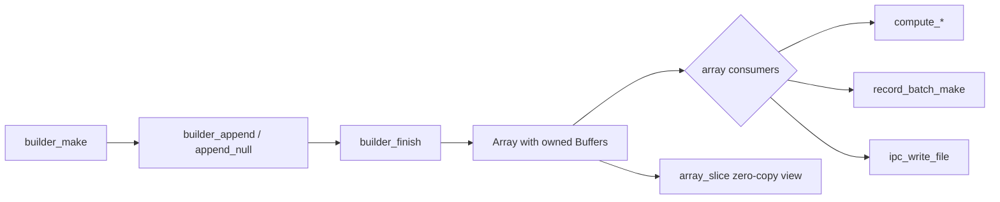
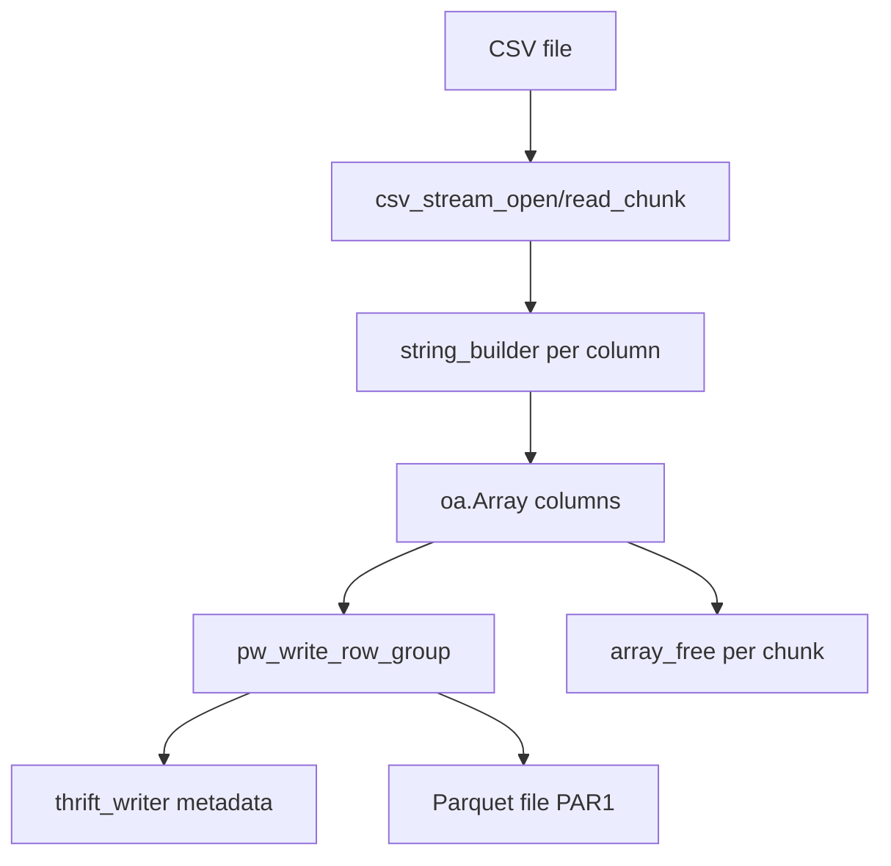
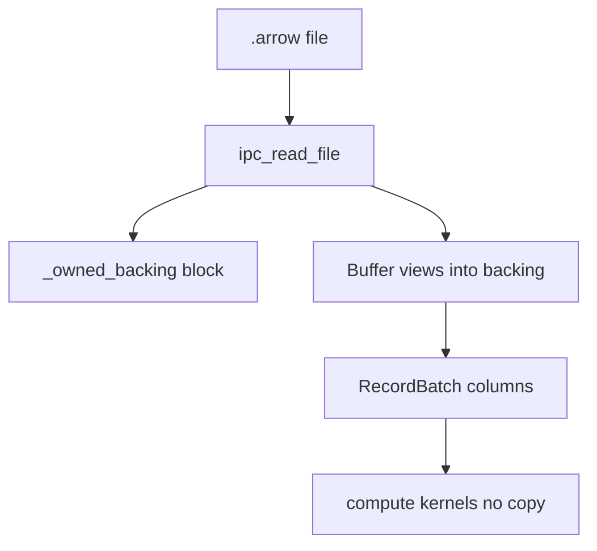

# OdinArrow — Code Review, Architecture, and Improvement Plan

> Generated: 2026-06-10  
> Scope: full repository review (`src/`, `programs/`, `tests/`, `benchmarks/`, build tooling)  
> Test status at review time: **105 tests passing** (`make test`)

---

## 1. Executive Summary

**OdinArrow** is a native [Odin](https://odin-lang.org/) implementation of the [Apache Arrow](https://arrow.apache.org/) columnar in-memory format. The library lives in `src/` under the `odinarrow` package and provides:

- Spec-aligned memory layout (64-byte aligned buffers, packed validity bitmaps, zero-copy slicing)
- Primitive and variable-length column types with builders
- Schema, RecordBatch, and Table abstractions
- Compute kernels (aggregations, filter, take, cast, arithmetic) with SIMD and multi-threaded variants
- Arrow IPC **file** format read/write (Feather v2 / random-access `.arrow` files)
- Benchmark harness comparing Odin, PyArrow, and Arrow C++

Beyond the core library, the repo ships **end-to-end CSV ↔ Parquet pipelines** in two flavors:

| Pipeline | Write | Read |
|---|---|---|
| Native Odin | `csv_to_parquet_odin` | `parquet_to_csv_odin` |
| Arrow C++ FFI | `csv_to_parquet_ffi` | `parquet_to_csv_ffi` |

The FFI path wraps PyArrow/Arrow C++ via thin C shims (`lib/libarrow_capi.so`, `lib/libparquet_capi.so`) for correctness baselines and performance comparison. The native Odin Parquet code is a focused subset (PLAIN encoding, UNCOMPRESSED, Thrift compact) — not a full Parquet implementation.

The existing `PLAN.md` describes the original design intent; this document reflects **what is actually implemented today** and proposes next steps.

---

## 2. Repository Layout

```
OdinArrow/
├── src/                          # Core library (package: odinarrow)
│   ├── buffer.odin               # 64-byte aligned allocation, slice, copy
│   ├── bitmap.odin               # Validity bitmap ops + popcount
│   ├── types.odin                # DataType tagged union + metadata helpers
│   ├── array.odin                # Central Array type, slice, accessors
│   ├── builders.odin             # Generic primitive builders (bool, int, float)
│   ├── var_length.odin           # String/Binary builders + array_get_string
│   ├── schema.odin               # Field, Schema
│   ├── record_batch.odin         # RecordBatch (columnar batch)
│   ├── table.odin                # Table + Chunked_Array
│   ├── compute.odin              # Serial compute kernels (~583 LOC)
│   ├── compute_simd.odin         # SIMD inner loops (sum, min/max)
│   ├── compute_parallel.odin     # Thread-pooled parallel kernels
│   └── ipc.odin                  # FlatBuffers builder + IPC file I/O (~1041 LOC)
│
├── programs/                     # Standalone CLI tools (not part of library API)
│   ├── csv_to_parquet_odin/       # Streaming CSV → native Parquet writer
│   ├── csv_to_parquet_ffi/        # CSV → Parquet via Arrow C++
│   ├── parquet_to_csv_odin/       # Native Parquet reader → CSV
│   └── parquet_to_csv_ffi/        # Parquet → CSV via Arrow C++
│
├── tests/                        # 105 unit/integration tests (no C++ dep)
├── tests_cpp/                    # FFI layout compatibility tests vs Arrow C++
├── benchmarks/
│   ├── odin/bench_main.odin       # Odin perf harness (threaded variants)
│   ├── python/                   # PyArrow equivalents
│   ├── cpp/                      # Arrow C++ C API + bench binary
│   ├── compare.sh                # 3-way markdown table
│   └── parquet_bench.sh          # CSV↔Parquet pipeline timing
│
├── bin/                          # Built binaries (gitignored artifacts)
├── lib/                          # Shared libs for FFI (gitignored)
├── Makefile                      # Build orchestration
├── PLAN.md                       # Original design doc (partially stale)
├── roundtrip_test.sh              # 1M-row CSV↔Parquet integration test
└── README.md                     # One-line description only
```

**Not present (mentioned in PLAN.md but missing):**

- `src/odinarrow.odin` — no single public re-export entry point
- `examples/quickstart.odin` — no getting-started example
- Dedicated `bench_ipc.odin` — IPC benchmark lives inside `bench_main.odin`

---

## 3. Architecture

### 3.1 Layered Design

```
┌─────────────────────────────────────────────────────────────────┐
│  CLI Programs (CSV↔Parquet, benchmarks)                        │
├─────────────────────────────────────────────────────────────────┤
│  Compute Layer   compute.odin + compute_simd + compute_parallel │
├─────────────────────────────────────────────────┬───────────────┤
│  Data Model      Schema / RecordBatch / Table  │  IPC (Feather) │
├───────────────────────────────────────────────┴───────────────┤
│  Column Layer    Array + Builders + var_length accessors      │
├───────────────────────────────────────────────────────────────┤
│  Memory Layer    Buffer (aligned) + Bitmap (validity bits)    │
└───────────────────────────────────────────────────────────────┘
         ▲                              ▲
         │ zero-copy buffer pointers      │ binary-compatible layout
         └────────── Arrow C++ FFI ──────┘
```

Design principles (consistent across the codebase):

| Principle | Implementation |
|---|---|
| Type dispatch | `DataType` tagged union + exhaustive `switch` (no vtables) |
| Memory ownership | Explicit per-buffer `Allocator`; slice views zero `allocator` |
| Zero semantics | `offset` + `length` into shared buffers (Arrow contract) |
| Errors | `(T, mem.Allocator_Error)` or `(T, bool)` — no exceptions |
| Performance | SIMD hot paths + optional `core:thread` parallel fan-out |
| Wire compatibility | Buffer layout matches Arrow C Data Interface |

### 3.2 Memory Layer

#### `Buffer` (`buffer.odin`, 80 LOC)

```odin
Buffer :: struct {
    data:      [^]u8,
    size:      int,
    capacity:  int,
    allocator: mem.Allocator,
}
```

- **`ARROW_ALIGNMENT = 64`** — matches Arrow spec / AVX-512 friendly padding
- **`buffer_make`** — allocates via `mem.alloc_aligned`, zero-fills
- **`buffer_slice`** — zero-copy view; returned buffer has `allocator = {}` (non-owning)
- **`buffer_free`** — skips non-owning buffers (`allocator.procedure == nil`)
- **`buffer_resize`** — in-place shrink or realloc+zero on grow

#### `Bitmap` (`bitmap.odin`, 80 LOC)

Packed little-endian validity bits (bit `i` → byte `i/8`, bit `i%8`).

| Procedure | Role |
|---|---|
| `bitmap_get/set/clear` | Per-element validity |
| `bitmap_popcount` | Count valid bits; masks partial final byte correctly |
| `bitmap_set_all/clear_all` | Bulk init |
| `bitmap_byte_count` | Size with 64-byte padding (safe `[^]u64` casts) |

---

### 3.3 Type System (`types.odin`, 133 LOC)

`DataType` is a tagged union of empty struct discriminants — type identity is the variant tag, no heap metadata.

**Implemented types:**

- Null, Bool
- Int8/16/32/64, UInt8/16/32/64, Float32/64
- String, Large_String, Binary, Large_Binary (large variants in type system only — no dedicated builders yet)

**Helper procs:** `type_byte_width`, `type_is_bit_packed`, `type_is_variable_length`, `type_is_integer`, `type_is_signed`, `type_is_floating`, `type_name`

**Not implemented:** temporal types (Date32/64, Timestamp), nested types (List, Struct, FixedSizeList), Dictionary encoding — though `Array.children` and `Array.dictionary` fields exist as stubs in comments/planned structure.

---

### 3.4 Array — Central Column Type (`array.odin`, 124 LOC)

```odin
Array :: struct {
    type:       DataType,
    length:     int,
    null_count: int,    // -1 = unknown (lazy recount)
    offset:     int,    // slice offset into buffers
    buffers:    [3]Buffer,
    children:   []Array,
}
```

**Buffer layout by column kind:**

| Column kind | `buffers[0]` | `buffers[1]` | `buffers[2]` |
|---|---|---|---|
| Fixed-width (int/float) | validity bitmap | typed values | unused |
| Bool | validity bitmap | bit-packed values | unused |
| String/Binary | validity bitmap | i32 offsets (n+1) | UTF-8 / raw bytes |

**Key operations:**

- `array_slice` — O(1) zero-copy; clears buffer allocators on result
- `array_get` / `array_try_get` — typed element access with offset handling
- `array_is_null` / `array_is_valid` — bitmap lookup
- `array_null_count` — cached or recount from bitmap
- `array_free` / `array_copy` — ownership-aware lifecycle

Variable-length accessors live in `var_length.odin`: `array_get_string`, `array_get_binary` (zero-copy views).

---

### 3.5 Builders

#### Primitive builder (`builders.odin`, 158 LOC)

Generic `Primitive_Builder($T)` using raw `[^]T` + `[^]u8` bitmap (not `[dynamic]T`) to reduce append overhead.

```
builder_make → builder_append / builder_append_null → builder_finish → Array
              builder_reset / builder_destroy
```

Supports: `bool`, all integer/float widths. First null triggers retroactive validity marking for prior elements.

#### Variable-length builders (`var_length.odin`, 207 LOC)

- `String_Builder` / `Binary_Builder` — dynamic offsets + data + bitmap
- Shared `_var_finish` materializes Arrow buffers on finish
- **Gap:** no `Large_String_Builder` / `Large_Binary_Builder` (i64 offsets)

---

### 3.6 Schema & Tabular Data

#### Schema (`schema.odin`)

```odin
Field  :: struct { name: string, type: DataType, nullable: bool }
Schema :: struct { fields: []Field, allocator: mem.Allocator }
```

Deep-copies field names on `schema_make`. Lookup via `schema_field_index`.

#### RecordBatch (`record_batch.odin`)

Row-oriented container: one `Array` per field, uniform `length`.

- `record_batch_make` — validates column count and equal lengths
- `_owned_backing` — supports zero-copy IPC reads (single backing block for all column views)
- `record_batch_free` — frees columns + optional backing; does **not** free borrowed schema

#### Table (`table.odin`)

Chunked columns for datasets spanning multiple batches:

```odin
Chunked_Array :: struct { type: DataType, chunks: []Array, length: int, ... }
Table        :: struct { schema: ^Schema, columns: []Chunked_Array, length: int, ... }
```

- `table_from_record_batches` — stacks batches into per-column chunk lists (borrows array data)
- `chunked_array_get` / `chunked_array_is_null` — logical index across chunks

**Gap:** no schema type validation when stacking batches (only field count checked).

---

### 3.7 Compute Layer

#### Serial kernels (`compute.odin`, 583 LOC)

| Kernel | Status | Notes |
|---|---|---|
| `compute_sum` | ✅ | f64 result; SIMD for i32/f64 without nulls |
| `compute_min` / `compute_max` | ✅ | Native-type compare; SIMD unroll for i32 |
| `compute_min_max` | ✅ | Single-pass combined min+max |
| `compute_mean` | ✅ | sum / valid_count |
| `compute_count` | ✅ | total + non-null |
| `compute_filter` | ✅ | Bool mask; typed + string/binary paths |
| `compute_take` | ✅ | Index array (i32 indices) |
| `compute_cast` | ✅ | Safe numeric widening/narrowing |
| `compute_add/sub/mul/div` | ✅ | Element-wise; null propagation |
| `sort_indices` | ❌ | Listed in PLAN.md, not implemented |

Dispatch pattern: top-level `switch` on `arr.type` → typed inner proc. Null-aware paths fall back to scalar loops.

#### SIMD (`compute_simd.odin`, 106 LOC)

Internal `#force_inline` helpers assuming `offset == 0`:

- `_sum_f64_simd` — 4-wide f64 SIMD, 4 unrolled accumulators
- `_sum_i32_simd` — 8-way i64 accumulation (sign-extend i32)
- `_min_i32_simd` / `_max_i32_simd` / `_min_max_i32_simd` — 8-way scalar unroll for LLVM vectorization

#### Parallel (`compute_parallel.odin`, 298 LOC)

Uses `core:thread` with zero-copy `array_slice` per chunk.

- `PARALLEL_MIN_LENGTH = 262_144` — below this, serial fallback
- `_resolve_threads` — caps threads by useful chunk count
- Parallel variants: `compute_sum_parallel`, `compute_min/max/mean_parallel`, `compute_min_max_parallel`, `compute_filter_parallel`
- Filter parallel path concatenates fixed-width results; variable-length filter parallel is limited

---

### 3.8 IPC — Arrow File Format (`ipc.odin`, 1041 LOC)

Self-contained **back-to-front FlatBuffers builder** (`FBB` struct) — no external FlatBuffers dependency.

**Supported:**

- ✅ IPC **file** writer: `ipc_write_file`
- ✅ IPC **file** reader: `ipc_read_file` (zero-copy column views into file block via `_owned_backing`)
- ✅ Schema + RecordBatch FlatBuffer encoding/decoding
- ✅ Types: primitives, utf8/binary, nulls, multi-batch files
- ✅ Cross-validation tested against PyArrow (per tests + PLAN notes)

**Not supported:**

- ❌ IPC **stream** format (sequential messages, no footer)
- ❌ Nested types, dictionaries in IPC
- ❌ Memory-mapped I/O (reads full file/block into memory)

File layout (documented in source):

```
"ARROW1\0\0" → schema message → record batch message(s) → EOS → footer → footer_len → "ARROW1"
```

---

### 3.9 CLI Programs & Parquet Subsystem

These are **application-layer** code importing `../../src` — not exported as library APIs.

#### CSV → Parquet (`programs/csv_to_parquet_odin/`)

| File | Responsibility |
|---|---|
| `main.odin` | CLI, memory budget (`-m MB`), chunked conversion loop |
| `csv_reader.odin` | Streaming RFC 4180 parser with refill buffer |
| `parquet_writer.odin` | PLAIN BYTE_ARRAY pages, UNCOMPRESSED, multi row-group |
| `thrift_writer.odin` | Thrift compact encoder for Parquet metadata |

Memory model: derive `max_rows` per chunk from `-m` limit; build OdinArrow string columns; write row group; free arrays.

#### Parquet → CSV (`programs/parquet_to_csv_odin/`)

| File | Responsibility |
|---|---|
| `main.odin` | CLI, buffered CSV output, chunked row processing |
| `parquet_reader.odin` | Footer parse, per-column page streams, dictionary pages |
| `thrift.odin` | Thrift compact decoder |

Supports: INT32 columns, BYTE_ARRAY strings, OPTIONAL/REQUIRED, dictionary encoding, multi row-group.

#### FFI wrappers

Thin Odin mains calling C API in `libparquet_capi.so` — same CLI surface as native tools.

#### Integration test (`roundtrip_test.sh`)

Generates 1M × 10 string columns, runs both pipelines, CSV-aware diff (handles quoting differences), timing summary.

---

### 3.10 Benchmarks & FFI Validation

#### Odin benchmarks (`benchmarks/odin/bench_main.odin`)

Scenarios (median of 5 trials):

- Array build 10M i32 (1% nulls)
- Sum / min+max / filter on 10M (threaded variants)
- String build 1M, string length scan 1M
- IPC roundtrip 10M i32

Output: `key=nanoseconds` lines consumed by `compare.sh`.

#### C++ shim (`benchmarks/cpp/`)

- `arrow_capi.*` — exposes Arrow compute on raw buffer pointers (layout compatibility proof)
- `parquet_capi.*` — CSV↔Parquet for FFI programs
- `bench_arrow_main.cpp` — standalone C++ benchmark binary

#### C++ interop tests (`tests_cpp/test_arrow_cpp.odin`)

Verifies Odin `Array` buffers produce identical results when handed to Arrow C++ for sum, min/max, filter, string scan.

---

## 4. Build System (`Makefile`)

| Target | Purpose | Dependencies |
|---|---|---|
| `make test` | Run 105 Odin tests | Odin only |
| `make test-cpp` | FFI layout tests | PyArrow paths, `libarrow_capi.so` |
| `make bench-odin` | Odin benchmarks | Odin only |
| `make bench-python` | PyArrow scripts | Python + pyarrow |
| `make bench-compare` | 3-way table | All above + `bench_arrow_cpp` |
| `make csv-to-parquet-odin/ffi` | Build converters | FFI needs `libparquet_capi.so` |
| `make parquet-odin/ffi` | Build readers | Same |
| `make bench-parquet` | Pipeline timing | Built binaries + `TEST_DATA` path |

**External coupling:** Arrow C++ paths resolved from `python3 -c "import pyarrow; ..."`. Hard-coded `ARROW_VER := 2400`. `TEST_DATA` points to `$(HOME)/Work/Projects/Odin/test_data.parquet` (machine-specific).

---

## 5. Test Coverage Summary

| Test file | Focus |
|---|---|
| `test_buffer.odin` | Alignment, slice, resize, copy |
| `test_bitmap.odin` | Bit ops, popcount edge cases |
| `test_array.odin` | Primitives, slice, null handling |
| `test_strings.odin` | String builder, offsets, unicode |
| `test_schema.odin` | Schema construction, field lookup |
| `test_compute.odin` | All serial compute kernels |
| `test_compute_parallel.odin` | Parallel vs serial equivalence |
| `test_ipc.odin` | IPC file roundtrip (i32, f64, strings, nulls, multi-batch) |

**Gaps in test coverage:**

- No dedicated tests for `table.odin` / `Chunked_Array`
- No tests for `record_batch` edge cases beyond IPC usage
- No unit tests for Parquet reader/writer (only `roundtrip_test.sh` integration)
- No tests for large string/binary types, cast edge cases, or error paths
- `tests_cpp/` requires built shared lib (not run by default `make test`)

---

## 6. Data Flow Diagrams

### 6.1 Array Construction



### 6.2 CSV → Parquet (Native)



### 6.3 IPC File Read (Zero-Copy)



---

## 7. Current Maturity Assessment

| Area | Maturity | Comment |
|---|---|---|
| Core memory/bitmap | **Stable** | Well-tested, spec-aligned |
| Primitive arrays/builders | **Stable** | Production-quality append path |
| String/binary columns | **Good** | Builder; large offset variant incomplete |
| Schema/RecordBatch | **Good** | IPC-integrated |
| Table/chunked | **Basic** | Minimal API, weak validation |
| Compute | **Good** | Broad coverage; missing sort |
| IPC file | **Good** | Largest module; stream format missing |
| IPC stream | **None** | — |
| Parquet (native) | **Experimental** | Subset encoding; works for roundtrip |
| Documentation | **Minimal** | README is one line; PLAN.md partially stale |
| Packaging | **Ad hoc** | Relative imports `../../src`; no package entry |

---

## 8. Improvement Plan

Prioritized roadmap. Effort: **S** (<1 day), **M** (1–3 days), **L** (3+ days).

### Phase A — Documentation & Developer Experience (Quick Wins)

| # | Item | Effort | Rationale |
|---|---|---|---|
| A1 | Expand `README.md` with install, `make test`, quick example | S | Onboarding; README currently empty |
| A2 | Add `examples/quickstart.odin` (build array → compute → IPC) | S | Planned in PLAN.md, still missing |
| A3 | Add `src/odinarrow.odin` re-export doc block listing public API | S | Single import surface for consumers |
| A4 | Sync `PLAN.md` checkboxes with reality (Parquet exists, stream still open) | S | Avoid contributor confusion |
| A5 | Document memory ownership rules (slice vs finish vs IPC read) in README | S | Subtle `allocator == nil` contract |

### Phase B — Core Library Completeness

| # | Item | Effort | Rationale |
|---|---|---|---|
| B1 | **`sort_indices` kernel** | M | Last major PLAN.md compute gap; unlocks order-by workflows |
| B2 | **Large string/binary builders** + array accessors (i64 offsets) | M | Types exist; builders/accessors missing |
| B3 | **IPC stream** reader/writer | L | Needed for socket/pipe protocols, Flight prep |
| B4 | **Schema validation** in `table_from_record_batches` | S | Compare field types/names across batches |
| B5 | **`compute_cast` extensions** — bool↔int, string parse | M | Real-world ETL needs |
| B6 | **Null_Type array** support in builders/compute | S | Edge type completeness |
| B7 | **Dictionary encoding** (array + IPC) | L | Compression + categorical columns |
| B8 | **Nested types** (List, Struct) | L | Arrow feature parity |

### Phase C — Performance

| # | Item | Effort | Rationale |
|---|---|---|---|
| C1 | SIMD null-aware sum/min/max | M | Scalar fallback dominates with nulls |
| C2 | SIMD filter (compress selected indices) | M | Hot path in analytics |
| C3 | Parallel `compute_take` / `compute_cast` | M | Symmetry with existing parallel ops |
| C4 | String scan SIMD (length sum) | M | Benchmark shows gap vs C++ |
| C5 | Consider `core:sync` thread pool | M | Avoid thread spawn per parallel call |
| C6 | Profile-guided buffer reuse in builders | M | Reduce alloc pressure on rebuild |

### Phase D — Testing & Quality

| # | Item | Effort | Rationale |
|---|---|---|---|
| D1 | **`test_table.odin`** — chunked access, multi-batch | S | Untested module |
| D2 | **`test_record_batch.odin`** — validation failures, column lookup | S | — |
| D3 | **Parquet unit tests** (footer parse, single page, dict page) | M | Today only shell integration |
| D4 | **Fuzz/property tests** for CSV reader + Thrift decoder | M | Binary formats need adversarial input |
| D5 | **CI workflow** (GitHub Actions: `make test`, optional test-cpp) | S | Prevent regressions |
| D6 | **Memory leak tests** under `-define:ODIN_TEST_TRACK_MEMORY` | S | Manual memory model |

### Phase E — Parquet Subsystem

| # | Item | Effort | Rationale |
|---|---|---|---|
| E1 | **SNAPPY/ZSTD compression** (even decode minimum) | L | Real Parquet files use compression |
| E2 | **RLE / DELTA encodings** | L | Interop with external files |
| E3 | **Shared `parquet/` package** extracted from programs | M | Reuse outside CLI tools |
| E4 | **Schema evolution** across row groups | M | Production datasets vary |
| E5 | **INT64/FLOAT/DOUBLE column support** in native writer | M | Reader partially supports; writer is string-only |
| E6 | **Page checksum validation** | S | Data integrity |

### Phase F — Build, Packaging, Interop

| # | Item | Effort | Rationale |
|---|---|---|---|
| F1 | **`odin.json` / collection manifest** for package manager | S | Standard Odin project layout |
| F2 | **Configurable Arrow path** (env var fallback if no PyArrow) | S | Makefile assumes PyArrow install |
| F3 | **Arrow C Data Interface export** (C headers / `foreign` procs) | L | Zero interop with Python/R/R |
| F4 | **Remove hard-coded `TEST_DATA` path** | S | Portability |
| F5 | **Optional `lib/` vendoring** or build-from-source Arrow | L | Reproducible CI |

### Phase G — Future / Out of Scope (Track Separately)

- Apache Arrow Flight (gRPC transport)
- Dataset API (partitioned scanning)
- GPU / CUDA compute
- Full Arrow Compute expression language
- Full Parquet specification compliance

---

## 9. Recommended Implementation Order

For maximum impact with minimal risk, tackle in this sequence:

1. **A1–A5, D5** — docs + CI (low risk, immediate contributor value)
2. **D1–D2, B4** — fill test gaps on existing stable code
3. **B1, B2** — close documented API holes (sort, large strings)
4. **C1–C2** — performance on null-aware paths (benchmark-visible)
5. **E3, E5** — elevate Parquet from CLI hack to library module
6. **B3, B7–B8** — larger Arrow parity features as needed

---

## 10. Key Files Reference

| Concern | Primary files |
|---|---|
| Memory | `src/buffer.odin`, `src/bitmap.odin` |
| Columns | `src/array.odin`, `src/builders.odin`, `src/var_length.odin` |
| Types | `src/types.odin` |
| Tabular | `src/schema.odin`, `src/record_batch.odin`, `src/table.odin` |
| Analytics | `src/compute.odin`, `src/compute_simd.odin`, `src/compute_parallel.odin` |
| Serialization | `src/ipc.odin`, `programs/*/parquet_*.odin`, `programs/*/thrift*.odin` |
| Validation | `tests/*.odin`, `tests_cpp/test_arrow_cpp.odin`, `roundtrip_test.sh` |
| Performance | `benchmarks/odin/bench_main.odin`, `benchmarks/compare.sh` |

---

## 11. Risks & Technical Debt

1. **Manual memory everywhere** — callers must pair `builder_finish`/`array_free`, `ipc_read_file`/`record_batch_free`, and never free sliced arrays' parent buffers early.
2. **Relative imports in programs** (`import oa "../../src"`) — fragile if repackaged; no versioned library boundary.
3. **PLAN.md drift** — claims Parquet out of scope, but substantial Parquet code exists; stream IPC still marked TODO while file IPC is done.
4. **Parquet subset** — native tools may silently fail on compressed or richly encoded files from other producers.
5. **Platform assumptions** — FFI gated on `ODIN_OS == .Linux`; no Windows/macOS story.
6. **Single large IPC module** — `ipc.odin` at 1041 LOC mixes FBB, schema, batch, file I/O; harder to maintain/test in isolation.

---

*This document should be updated when major phases land (especially B1 sort, B3 IPC stream, E3 Parquet package extraction).*
